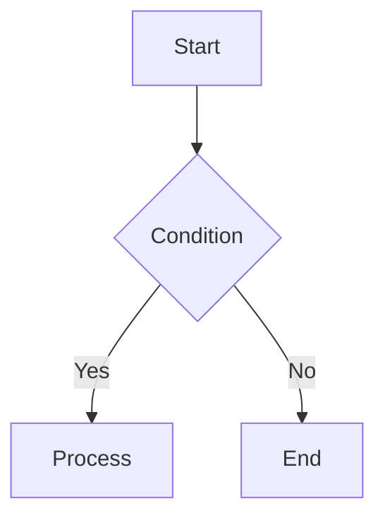
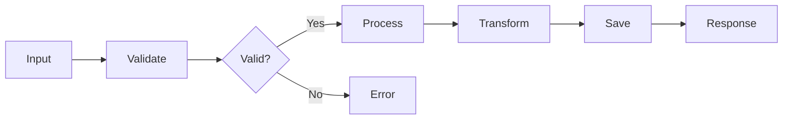
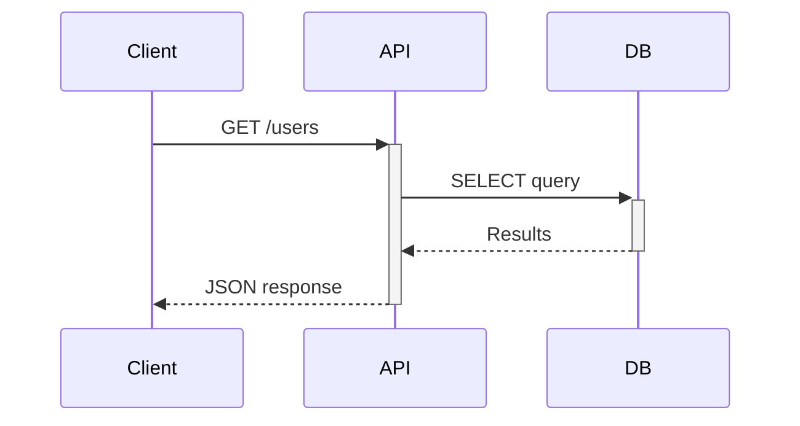
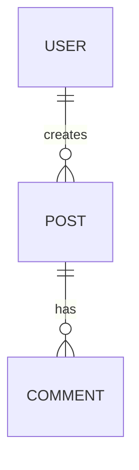

# Slidev Presentation Creator

Generate Slidev markdown-based presentations through an interview workflow.

## Trigger Examples

<example>
Context: User wants to create a presentation
user: "PT 만들어줘"
assistant: Loads create-slide skill, starts interview to gather presentation requirements.
<commentary>
Presentation creation request without details - start interview.
</commentary>
</example>

<example>
Context: User has specific topic
user: "React Server Components에 대해 발표 자료 만들어줘"
assistant: Loads create-slide skill, starts interview with topic pre-filled.
<commentary>
Topic given but other details needed - interview with context.
</commentary>
</example>

<example>
Context: User wants slides in existing Slidev project
user: "새 슬라이드 추가해줘"
assistant: Loads create-slide skill, detects existing project, skips setup.
<commentary>
Existing project detected - skip setup, go straight to content creation.
</commentary>
</example>

## Critical Rules

1. **Interview first** - Always gather information through interview before generating slides
2. **Use AskUserQuestion** - All questions must use the AskUserQuestion tool
3. **Auto-detect** - Automatically detect Slidev project existence and branch between setup/create
4. **Anti-AI writing** - Natural text that doesn't sound AI-generated
5. **User's language** - Use the user's preferred language for content, keep technical terms unchanged
6. **Leverage mcpdocs/deepwiki** - Look up documentation in real-time when Slidev syntax is uncertain

## Auto-Detect Logic

When the skill runs, check in this order:

```
1. Does package.json have slidev dependencies?
2. Does slides.md or any *.md Slidev file exist?
3. If neither exists → Execute Setup Phase
4. If exists → Go straight to Interview Phase
```

---

## Phase 0: Setup (Only when Slidev project doesn't exist)

### Execution Condition
- When `@slidev/cli` is not in `package.json` or `package.json` doesn't exist

### Procedure

1. Initialize Slidev project:
```bash
npm init slidev@latest
```

2. Theme auto-installation: Slidev detects the theme from frontmatter and prompts to install it on first run. No manual `npm install` needed for themes.

3. Verify basic directory structure:
```
project/
  package.json
  slides.md
  components/     # Custom Vue components
  public/         # Images, assets
  pages/          # Split slides (optional)
```

4. After setup completes, proceed to Interview Phase

---

## Phase 1: Interview (Information Gathering)

Conduct the interview step by step. Use AskUserQuestion at each stage.

### Step 1: Basic Information

Items to collect:
- **Presentation topic**: What is the presentation about?
- **Audience**: Who is the audience? (developers, non-developers, mixed)
- **Duration**: How many minutes? (used to determine slide count)
- **Filename**: Output file name (default: slides.md)

Slide count guide by duration:
| Duration | Slide Count | Notes |
|----------|-------------|-------|
| 5 min | 5-8 slides | Lightning talk |
| 10 min | 8-12 slides | Short talk |
| 20 min | 15-20 slides | Standard |
| 30 min | 20-30 slides | Conference talk |
| 45+ min | 30-40 slides | Keynote |

### Step 2: Structure and Content

Items to collect:
- **Core message**: The one thing the audience should remember
- **Section structure**: Main sections to cover
- **Code examples**: Need to show code? Which language/framework?
- **Diagrams**: Need visuals like architecture, flowcharts, ERDs?
- **Demos**: Need live coding or interactive elements?

### Step 3: Style and Tone

Items to collect:
- **Theme selection**: Present theme options
- **Tone**: Formal / Friendly / Educational / Technical
- **Special requirements**: Company logo, specific colors, fonts, etc.

Theme options (present via AskUserQuestion):
| Theme | Style | Best For |
|-------|-------|----------|
| `apple-basic` (default) | Apple Keynote style, clean and minimal | General purpose, tech talks |
| `seriph` | Serif fonts, classic feel | Academic, formal presentations |
| `geist` | Vercel/Geist design system, clean and modern | Frontend, web technologies |
| `purplin` | Purple gradient, vibrant feel | Product launches, demos |
| `academic` | Academic paper style | Research presentations, paper introductions |
| `bricks` | Block-based, structural | Architecture, system design |

- **Visual Level**: Present visual level options

| Level | Includes | Best For |
|-------|----------|----------|
| Minimal | Icons, fade-out transition, v-clicks, py-10 padding, global page numbers | Quick talks, internal presentations |
| Rich | All Minimal + glassmorphism cards, $clicks animations, glow background, attributify mode, v-mark, dark mode | Conference talks, KubeCon/JSConf level |

---

## Phase 2: Slide Generation

### Basic Flow Structure

Apply this standard flow based on interview results:

```
Cover (intro layout)
  → Agenda/Table of Contents (default/toc layout)
  → Section 1 Title (section layout)
    → Section 1 Content Slides
  → Section 2 Title (section layout)
    → Section 2 Content Slides
  → ...
  → Summary (default layout)
  → Q&A (end layout)
```

### Headmatter Template

**Minimal headmatter:**

```yaml
---
theme: apple-basic
title: "{Presentation Title}"
info: |
  {Brief description}
author: "{Presenter}"
keywords: "{Keywords}"
fonts:
  sans: Pretendard
  mono: Fira Code
mdc: true
transition: fade-out
drawings:
  persist: false
layout: intro
---
```

**Rich headmatter** (when user selects Rich visual level):

```yaml
---
theme: apple-basic
title: "{Presentation Title}"
info: |
  {Brief description}
author: "{Presenter}"
keywords: "{Keywords}"
fonts:
  sans: Pretendard
  mono: Fira Code
mdc: true
transition: fade-out
drawings:
  persist: false
css: unocss
colorSchema: dark
preload: false
layout: intro
class: text-center
---
```

### Default Font Setup

Pretendard is the default sans-serif font. Since it's not on Google Fonts, a CDN import is required.

Create `styles/index.css` in the project root:

```css
@import url('https://cdn.jsdelivr.net/gh/orioncactus/pretendard/dist/web/static/pretendard.min.css');
```

This file is automatically loaded by Slidev. The `fonts.sans: Pretendard` in headmatter then applies it globally.

### Global Layer (`global-bottom.vue`)

**Minimal:**

```vue
<!-- components/global-bottom.vue -->
<template>
  <footer v-if="$nav.currentPage > 1" class="absolute bottom-0 left-0 right-0 px-6 py-3 flex justify-between text-xs opacity-50">
    <span>{{ $slidev.configs.author }}</span>
    <span>{{ $nav.currentPage }} / {{ $nav.total }}</span>
  </footer>
</template>
```

**Rich:** See references/glow-background.md for full glow polygon implementation that includes page numbers.

### Layout Selection Guide

Choose appropriate layouts based on content type:

| Content Type | Layout | Notes |
|-------------|--------|-------|
| First slide (title) | `intro` / `intro-image` | apple-basic exclusive |
| Image + text | `image-right` / `image-left` / `intro-image-right` | Includes apple-basic exclusive |
| Section divider | `section` | Start section with large text |
| General content | `default` | Basic text + lists |
| Bullets only | `bullets` | apple-basic exclusive |
| Code-focused | `default` | Code block heavy |
| Comparison/2-column | `two-cols` / `two-cols-header` | Left-right split |
| Quote | `quote` | Emphasize specific sentences |
| Numbers/stats | `fact` | Large number + description |
| Emphasis statement | `statement` | Highlight core message |
| Full-screen image | `image` | Background image |
| 3 images | `3-images` | apple-basic exclusive |
| Web page embed | `iframe` / `iframe-left` / `iframe-right` | URL embedding |
| Final slide | `end` | Thanks, Q&A |

### Slide Writing Rules

Follow these principles when writing each slide:

1. **One idea per slide** - Don't mix multiple topics on a single slide
2. **Minimize text** - 3-5 bullet points, one line per item
3. **Use v-click** - Show content sequentially to maintain audience focus
4. **Code essentials only** - Highlight key parts, not entire code
5. **Leverage diagrams** - Visualize with Mermaid instead of text explanations
6. **Include presenter notes** - Write presenter notes for each slide

### Visual Patterns (Minimal)

Apply these patterns when Visual Level is Minimal (or higher):

- Wrap all bullet lists in `<v-clicks>` by default
- Add `class: py-10` to content slides frontmatter
- Use icons for technical content: `<div i-logos:xxx />` for tech logos, `<div i-carbon:xxx />` for UI icons
- Include `[click]` markers in presenter notes for each v-click
- Icon package installation: `npm add -D @iconify-json/carbon @iconify-json/logos @iconify-json/mdi`

### Visual Patterns (Rich)

All Minimal items above, plus:

- Use glassmorphism card pattern for content organization (see references/visual-patterns.md)
- Apply color semantics: red=problems, green=solutions, blue=technical, purple=code, yellow=warnings
- Use `$clicks` conditional class binding for card entrance animations:
  ```html
  <div
    v-click flex flex-col gap-2 items-center transition duration-500 ease-in-out
    :class="$clicks < 1 ? 'translate-x--20 opacity-0' : 'translate-x-0 opacity-100'"
  >
  ```
- Add glow polygon background via global-bottom.vue (see references/glow-background.md)
- Use UnoCSS attributify mode (no `class=""` needed)
- Apply v-mark for text highlighting:
  ```html
  <span v-mark="{ at: 2, color: 'rgb(144, 200, 255)', type: 'underline' }">keyword</span>
  ```
- Add staggered delay animations for sequential reveals
- Generate `uno.config.ts` with attributify + icons + safelist:
  ```ts
  import config from '@slidev/client/uno.config'
  import { mergeConfigs, presetAttributify, presetIcons, presetWebFonts, presetWind3 } from 'unocss'

  export default mergeConfigs([config, {
    safelist: [
      ...Array.from({ length: 30 }, (_, i) => `delay-${(i + 1) * 100}`),
      'animate-pulse',
    ],
    presets: [
      presetWind3({ dark: 'class' }),
      presetAttributify(),
      presetIcons({
        prefix: 'i-',
        extraProperties: { display: 'inline-block', 'vertical-align': 'middle' },
      }),
      presetWebFonts({ fonts: { sans: 'DM Sans' } }),
    ],
  }])
  ```
- Add scoped CSS: fade-out blur, code glassmorphism, v-mark scaling, dark background override:
  ```css
  /* fade-out blur */
  .slidev-vclick-target { transition: opacity 500ms ease, filter 200ms ease, color 300ms ease; }
  .slidev-vclick-hidden { opacity: 0; pointer-events: none; filter: blur(3px); }

  /* code glassmorphism */
  :root { --slidev-code-padding: 8px 10px; --slidev-code-background: #16161690 !important; }
  .slidev-code { backdrop-filter: blur(10px); border: 1px solid #eee1; }

  /* v-mark scaling */
  .rough-annotation > path[stroke-width='2'] { stroke-width: calc(2px * var(--slidev-slide-scale)); }

  /* dark background override */
  .dark #slide-content { background-color: black !important; }
  ```

### Code Block Writing

```markdown
# Basic code block (line highlighting)
```ts {2|4-6|all}
function greet(name: string) {
  console.log(`Hello, ${name}`)  // Click 1: highlight this line

  return {                        // Click 2: highlight this block
    message: `Hello, ${name}`,
    timestamp: Date.now()
  }
}
```

# Shiki Magic Move (code change animation)
````md
```ts {*|*|*}{lines:true}
// Show step-by-step code changes with animation
```
````

# Monaco Editor (live coding)
```ts {monaco}
// Editable code editor during presentation
console.log('edit me')
```
```

### Mermaid Diagrams

When a diagram has 7 or more nodes, switch to horizontal direction (`LR`) and reduce scale to prevent overflow:

```markdown
# Small diagram (< 7 nodes) - vertical is fine


# Large diagram (7+ nodes) - use LR direction + scale down


# Sequence diagram


# ERD

```

### Animations & Transitions

```markdown
# v-click: sequential reveal
<v-click>

- First point

</v-click>

<v-click>

- Second point

</v-click>

# v-clicks: auto sequential reveal of children
<v-clicks>

- Item 1
- Item 2
- Item 3

</v-clicks>

# Slide transition effects (frontmatter)
---
transition: fade-out
---

# Default: fade-out (recommended, includes blur cross-fade)
# Available: fade, fade-out, slide-left, slide-right, slide-up, slide-down
# Per-slide override for complex animation slides:
---
transition: 'none'
---
```

---

## Anti-AI Writing Rules (Mandatory)

Apply these rules to all generated text.
Based on Wikipedia's "Signs of AI writing" guidelines.

### Absolutely Forbidden Expressions

| Category | Forbidden |
|---------|----------|
| Exaggeration | "innovative", "groundbreaking", "powerful", "plays a key role" |
| AI vocabulary | "delve", "crucial", "landscape", "tapestry", "vibrant", "foster", "showcase", "underscore" |
| Promotional | "amazing", "outstanding", "perfect", "seamless", "revolutionary" |
| Empty phrases | "needless to say", "goes without saying", "noteworthy" |
| Patterns | Rule of three overuse, em dash (---) overuse, bold header lists |
| Conclusions | "bright future", "exciting era", "unlimited possibilities" |

### Write Like This Instead

- **Be specific**: Instead of "good performance", say "response time dropped from 200ms to 50ms"
- **Be direct**: Instead of "one could say that", say "is"
- **Be brief**: One line per bullet. If explanation needed, put it in presenter notes
- **Use real data**: Numbers, benchmarks, examples instead of vague claims
- **Be natural**: Tone that the presenter would actually use

### Natural Presenter Notes Too

```markdown
<!--
Pause here and check audience reaction.
Start with "Why this matters is..."
If demo fails, skip to the screenshot slide.
-->
```

Don't use "Certainly!", "Let me explain", "This is crucial" in notes.
Only write natural guidance you'd actually use during a presentation.

## Anti-AI Visual Design Rules (Mandatory)

### Banned Visual Patterns

| Banned | Description |
|--------|-------------|
| Purple-green gradients | `from-purple-500 to-green-400` type combos |
| Neon color combos | `#ff00ff`, `#00ffff` oversaturated pairs |
| Accent bars | Decorative color bars at slide edges |
| Excessive gradients | Full-background gradients (text gradient only OK) |
| Direct neon glow | Neon/glow effects directly on elements |
| Rainbow color listing | 5+ random colors on one slide |

### Allowed Visual Treatments

- Theme-color gradient text (h1 only, limited)
- Solid backgrounds (`background: '#1e293b'`)
- Glassmorphism cards: `backdrop-blur` + translucent bg + border
- v-mark Rough Notation style (hand-drawn feel)
- Glow polygon background: `blur(70px)` subtle gradient (Rich only)
- Color semantic cards: consistent meaning within `{color}-800/20`

---

## Phase 3: Review & Output

### Post-Generation Steps

1. **Save file**: Save with filename specified in interview
2. **Structure summary**: Show generated slide structure in table format
3. **Execution guide**: Provide `npx slidev {filename}` command
4. **Edit suggestions**: Check if any additions/modifications needed

### Output Example

```
slides.md generated (18 slides)

| # | Layout | Title |
|---|---------|------|
| 1 | intro | React Server Components |
| 2 | default | Agenda |
| 3 | section | What are Server Components? |
| ...

Run: npx slidev slides.md
Edit: npx slidev slides.md --open (with editor)
PDF: npx slidev export slides.md
```

---

## mcpdocs/deepwiki Usage Guide

Look up documentation in real-time when Slidev syntax or features are uncertain.

### Using mcpdocs

```
# Check Slidev doc sources
mcp__mcpdocs__list_doc_sources → Check "slidev" entry

# Look up specific syntax
mcp__mcpdocs__fetch_docs(url="https://sli.dev/guide/syntax.md")
mcp__mcpdocs__fetch_docs(url="https://sli.dev/builtin/layouts.md")
mcp__mcpdocs__fetch_docs(url="https://sli.dev/builtin/components.md")
```

### Using deepwiki

```
# Questions about Slidev architecture or advanced features
mcp__deepwiki__ask_question(
  repoName="slidevjs/slidev",
  question="How does v-click animation work with nested elements?"
)
```

### When to Look Up
- When checking theme-specific layouts
- When using new Slidev features
- When user requests a specific feature but you're uncertain
- When errors occur or syntax doesn't work

---

## Example: Minimal slides.md

```markdown
---
theme: apple-basic
title: React Server Components 실전 가이드
info: |
  React 18의 Server Components를 실제 프로젝트에 적용하는 방법
author: ""
fonts:
  sans: Pretendard
  mono: Fira Code
mdc: true
transition: fade-out
drawings:
  persist: false
layout: intro
---

# React Server Components 실전 가이드

RSC가 바꾸는 React 개발 방식

<div class="absolute bottom-10">
  <span class="font-700">
    2026.02 / 사내 기술 공유
  </span>
</div>

<!--
인사하고 바로 시작합니다.
"오늘은 RSC를 실제로 써보면서 배운 것들을 공유하려고 합니다."
-->

---
layout: default
class: py-10
---

# 목차

<Toc />

<!--
목차는 빠르게 훑고 넘어갑니다. 30초.
-->

---
layout: section
---

# Server Components란?

<!--
"먼저 Server Components가 뭔지부터 짚고 가겠습니다."
-->

---
class: py-10
---

# Client vs Server Component

<v-clicks>

- <div i-carbon:server-proxy class="inline-block mr-1" /> Server Component: 서버에서 렌더링, 번들에 포함되지 않음
- <div i-carbon:application-web class="inline-block mr-1" /> Client Component: `"use client"` 선언, 브라우저에서 실행
- 기본값이 Server Component (React 18+)

</v-clicks>

<!--
[click] SC 설명 -- "서버에서만 실행되니까 클라이언트 번들에 안 들어갑니다."
[click] CC 설명 -- "useState 같은 훅이 필요하면 use client를 붙입니다."
[click] 기본값 강조
-->

---
layout: fact
---

# 40%
번들 사이즈 감소 (실제 프로젝트 적용 결과)

<!--
"저희 프로젝트에서 SC 전환 후 측정한 수치입니다."
구체적인 before/after 수치를 준비해두세요.
-->

---
layout: end
---

# 감사합니다

질문 있으시면 편하게 해주세요.
```

## Example: Rich slides.md (KubeCon level)

```markdown
---
theme: apple-basic
title: Kubernetes Gateway API 도입기
info: |
  Gateway API로 Ingress를 대체한 과정과 결과
author: ""
fonts:
  sans: Pretendard
  mono: Fira Code
mdc: true
transition: fade-out
drawings:
  persist: false
css: unocss
colorSchema: dark
preload: false
layout: intro
class: text-center
---

# Kubernetes Gateway API 도입기

Ingress에서 Gateway API로의 전환

<div absolute bottom-10 text-sm opacity-70>
  2026.02 / KubeCon Seoul
</div>

<!--
인사하고 바로 시작합니다.
-->

---
class: py-10
glowSeed: 42
---

# 왜 Gateway API인가?

<div grid grid-cols-2 gap-6 mt-8>
  <div
    v-click border="2 solid red-800" bg="red-800/20" rounded-lg overflow-hidden
    transition duration-500 ease-in-out
    :class="$clicks < 1 ? 'translate-x--20 opacity-0' : 'translate-x-0 opacity-100'"
  >
    <div bg="red-800/40" px-4 py-2 flex items-center>
      <div i-carbon:warning-alt text-red-300 text-xl mr-2 />
      <span font-bold>Ingress의 한계</span>
    </div>
    <div px-4 py-3>
      <v-clicks>

      - Header 기반 라우팅 불가
      - 멀티 클러스터 미지원
      - 구현체마다 다른 annotation

      </v-clicks>
    </div>
  </div>

  <div
    v-click border="2 solid green-800" bg="green-800/20" rounded-lg overflow-hidden
    transition duration-500 ease-in-out
    :class="$clicks < 4 ? 'translate-x-20 opacity-0' : 'translate-x-0 opacity-100'"
  >
    <div bg="green-800/40" px-4 py-2 flex items-center>
      <div i-carbon:checkmark-filled text-green-300 text-xl mr-2 />
      <span font-bold>Gateway API</span>
    </div>
    <div px-4 py-3>
      <v-clicks>

      - 표준화된 라우팅 규칙
      - Role-oriented 리소스 모델
      - 크로스 네임스페이스 지원

      </v-clicks>
    </div>
  </div>
</div>

<!--
[click] 왼쪽 카드 등장 -- "기존 Ingress의 문제부터 보겠습니다."
[click] Header 라우팅
[click] 멀티 클러스터
[click] 오른쪽 카드 등장 -- "Gateway API는 이걸 어떻게 해결하는가."
[click] 표준화
[click] Role-oriented
[click] 크로스 네임스페이스
-->

---
class: py-10
glowSeed: 128
---

# 성능 비교

<span v-mark="{ at: 1, color: 'rgb(144, 200, 255)', type: 'underline' }">P99 latency</span>가 핵심 지표

<div mt-6 border="2 solid blue-800" bg="blue-800/20" rounded-lg overflow-hidden>
  <div bg="blue-800/40" px-4 py-2 flex items-center>
    <div i-carbon:chart-line text-blue-300 text-xl mr-2 />
    <span font-bold>벤치마크 결과</span>
  </div>
  <div px-4 py-3>
    <v-clicks>

    - Ingress: P99 latency 45ms
    - Gateway API: P99 latency 12ms (73% 감소)
    - 설정 반영 시간: 30s -> 2s

    </v-clicks>
  </div>
</div>

<style>
.slidev-vclick-target { transition: opacity 500ms ease, filter 200ms ease, color 300ms ease; }
.slidev-vclick-hidden { opacity: 0; pointer-events: none; filter: blur(3px); }
</style>

<!--
[click] v-mark로 P99 latency 밑줄
[click] Ingress 수치
[click] Gateway API 수치 -- "73% 감소. 이건 실측 데이터입니다."
[click] 설정 반영 시간
-->

---
layout: end
---

# 감사합니다

질문 있으시면 편하게 해주세요.
```

---

## Notes

- This skill is based on the official Slidev documentation (https://sli.dev)
- Theme-specific layouts can be found in references/themes.md
- When Slidev syntax is updated, look up the latest documentation via mcpdocs
- Also see the official Slidev skill: `npx skills add slidevjs/slidev`

### Visual Enhancement References

- references/visual-patterns.md - Card patterns, color semantics, comparison layouts
- references/icons.md - Icon system installation and usage
- references/glow-background.md - Glow polygon background (Rich only)
