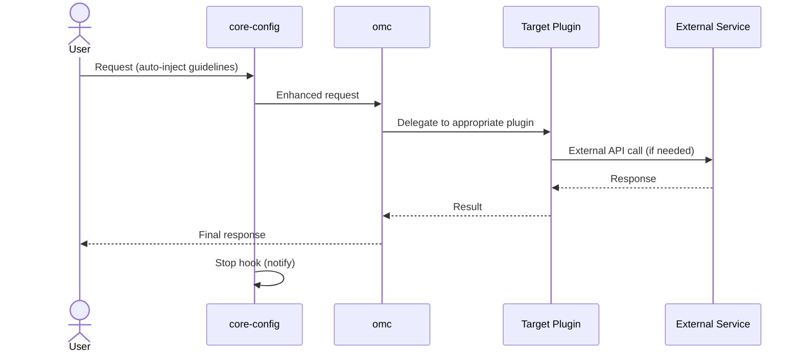

# oh-my-claudecode System Architecture

## Overview

<!-- workflow-viz: system-overview -->
<!-- last-updated: 2026-05-05 22:56:00 -->

## C4 Container Diagram

```mermaid
%%{init: {'theme':'base', 'themeVariables': {
  'primaryColor':'#3B82F6',
  'primaryTextColor':'#fff',
  'primaryBorderColor':'#2563EB',
  'lineColor':'#6B7280',
  'secondaryColor':'#10B981',
  'tertiaryColor':'#F59E0B'
}}}%%
flowchart TB
    subgraph User["User"]
        U[Claude Code User]
    end

    subgraph System["oh-my-claudecode"]
        subgraph Core["Core Layer"]
            CC[core-config<br/>Hooks: guidelines, format, notify]
            OMC[omc<br/>Multi-agent orchestration]
        end

        subgraph Development["Development Tools"]
            GD[github-dev<br/>Commands: resolve-issue, PR, etc.]
            IR[interactive-review<br/>Web UI code review]
            DF[docs-forge<br/>README/CHANGELOG]
        end

        subgraph Research["Research & Search"]
            CS[code-scout<br/>Resource discovery]
            DW[deepwiki<br/>GitHub repo docs]
            PS[paper-search-tools<br/>Academic papers]
        end

        subgraph AI["AI Models"]
            CO[council<br/>Multi-model deliberation]
            MJ[midjourney<br/>Image generation]
        end

        subgraph Content["Content & Docs"]
            SL[slidev<br/>Presentations]
            TR[translator<br/>Translation]
            HU[humanizer<br/>AI text humanizer]
            NO[notion<br/>Notion upload]
        end

        subgraph Tools["Dev Tools"]
            NB[notebook<br/>Jupyter editing]
            ML[ml-toolkit<br/>ML tools]
            IV[interview<br/>Requirements]
        end
    end

    subgraph External["External Services"]
        GH[(GitHub)]
        HF[(HuggingFace)]
        AR[(arXiv/PubMed)]
        NT[(Notion API)]
        MJA[(Midjourney API)]
    end

    U --> System
    GD --> GH
    CS --> GH
    CS --> HF
    DW --> GH
    PS --> AR
    NO --> NT
    MJ --> MJA

    classDef coreStyle fill:#3B82F6,stroke:#2563EB,color:#fff
    classDef devStyle fill:#10B981,stroke:#059669,color:#fff
    classDef researchStyle fill:#8B5CF6,stroke:#7C3AED,color:#fff
    classDef aiStyle fill:#F59E0B,stroke:#D97706,color:#fff
    classDef contentStyle fill:#EC4899,stroke:#DB2777,color:#fff
    classDef toolStyle fill:#6366F1,stroke:#4F46E5,color:#fff

    class CC,OMC coreStyle
    class GD,IR,DF devStyle
    class CS,DW,PS researchStyle
    class CO,MJ aiStyle
    class SL,TR,HU,NO contentStyle
    class NB,ML,IV toolStyle
```

## Plugin Categories

| Category | Plugins | Purpose |
|----------|---------|---------|
| **Core** | core-config, omc | Foundation: hooks, orchestration |
| **Development** | github-dev, interactive-review, docs-forge | Code workflow |
| **Research** | code-scout, deepwiki, paper-search-tools | Information gathering |
| **AI Models** | council, midjourney | External AI services |
| **Content** | slidev, translator, humanizer, notion | Document creation |
| **Tools** | notebook, ml-toolkit, interview | Specialized utilities |

## Data Flow

## See Also

- [Plugin Workflows](./workflows/) - Individual plugin flowcharts
- [Progress State](.omc/state/workflow-progress.json) - Current execution state
