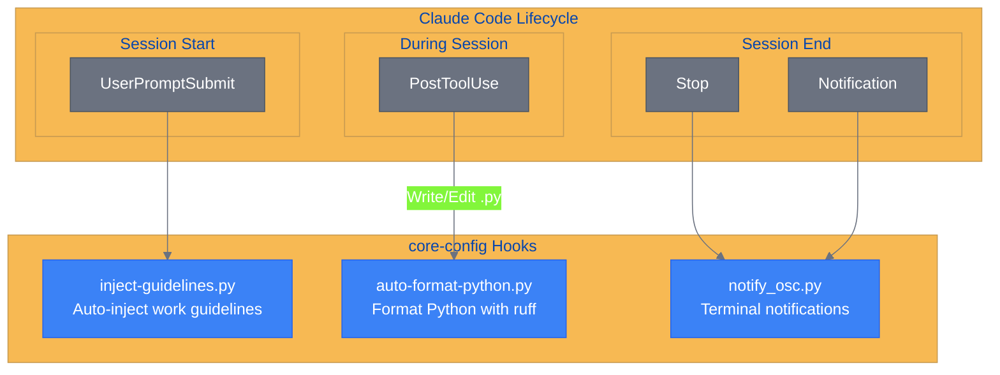
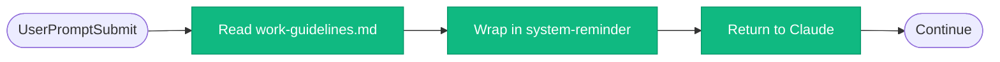
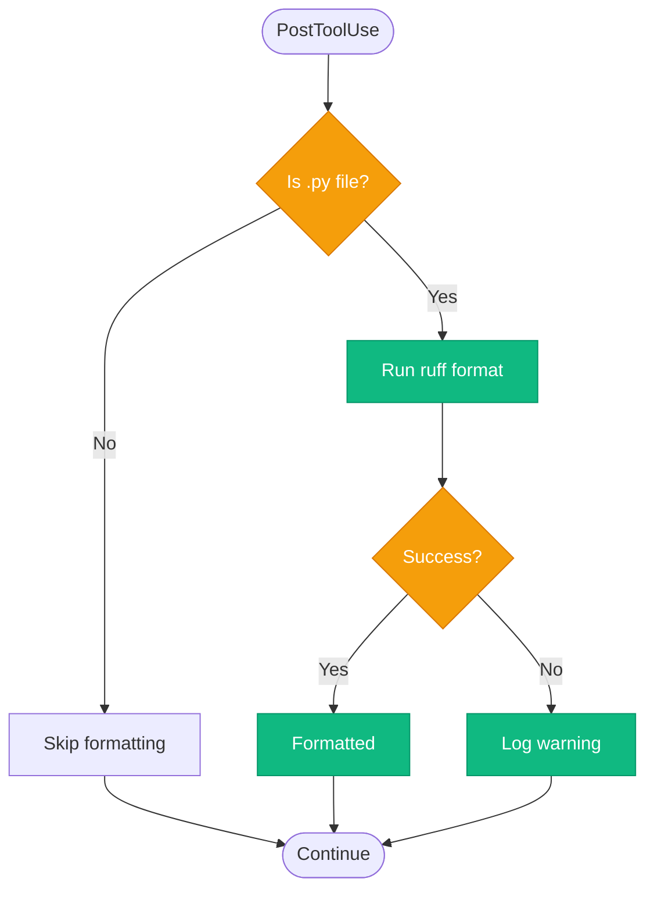
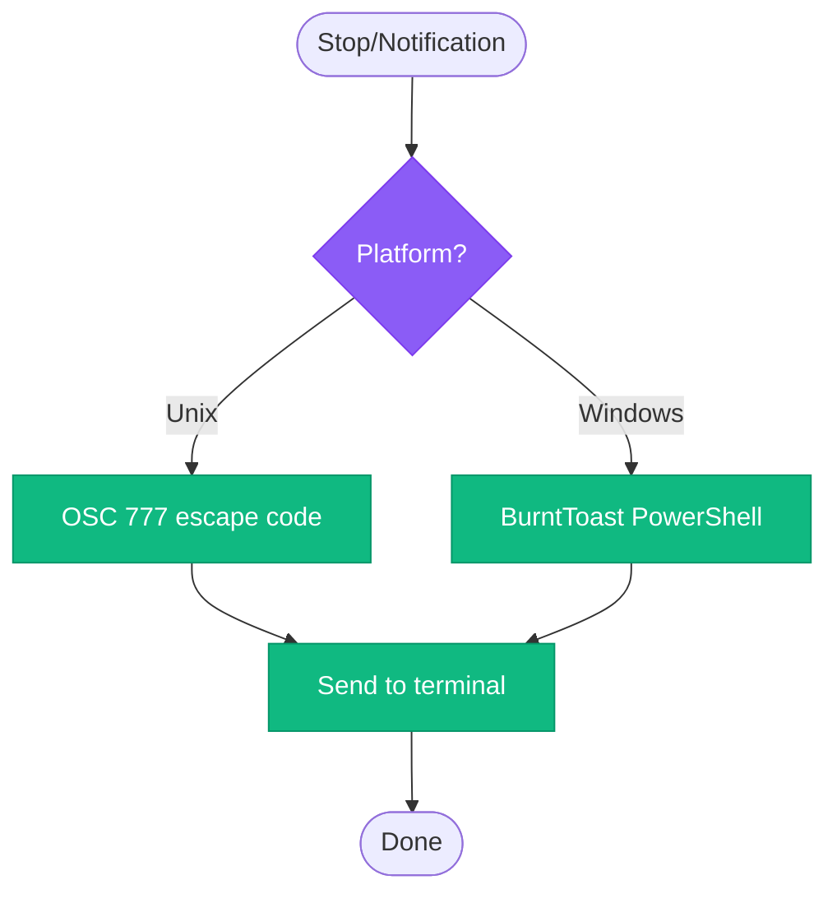

# core-config Workflow

<!-- workflow-viz: core-config -->
<!-- last-updated: 2026-05-15 22:07:58 -->

## Overview

Core development configuration with lifecycle hooks.

## Hook Event Flow



## inject-guidelines Flow



## auto-format-python Flow



## notify_osc Flow



## Hook Configuration

```json
{
  "hooks": {
    "UserPromptSubmit": [{ "command": "inject-guidelines.py" }],
    "PostToolUse": [{ "matcher": "Write|Edit", "command": "auto-format-python.py" }],
    "Stop": [{ "command": "notify_osc.py" }],
    "Notification": [{ "command": "notify_osc.py" }]
  }
}
```
