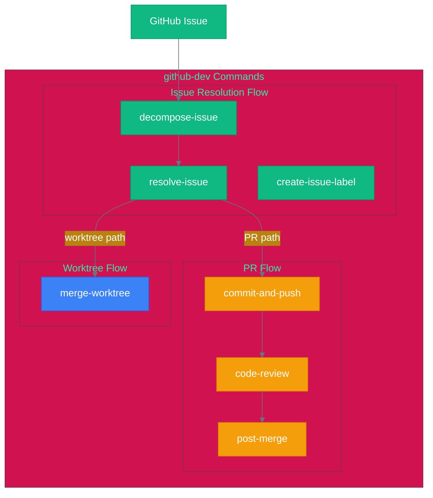
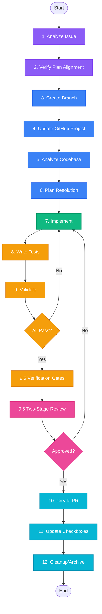
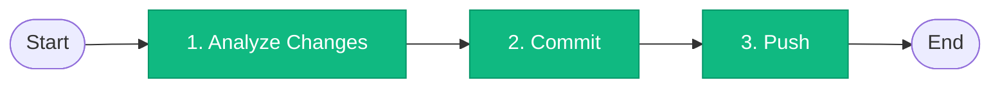

# github-dev Workflow

<!-- workflow-viz: github-dev -->
<!-- last-updated: 2026-04-28 11:36:46 -->

## Overview

GitHub workflow automation with 9 commands.

## Command Flowchart



## resolve-issue Detail (12 Phases)



## commit-and-push Detail (3 Phases)



## State File Schema

Location: `.omc/state/github-dev-{issue}.json`

```json
{
  "sessionId": "github-dev-123-2026-02-12T10:00:00Z",
  "command": "resolve-issue",
  "issueNumber": 123,
  "phase": "implement",
  "checkpoints": [
    { "phase": "analyze", "status": "complete" },
    { "phase": "implement", "status": "in_progress" }
  ]
}
```

## Progress Indicators

| Symbol | Status |
|--------|--------|
| ✓ | Phase completed |
| ▶ | Currently executing |
| ○ | Not started |
| ✗ | Failed (needs retry) |
