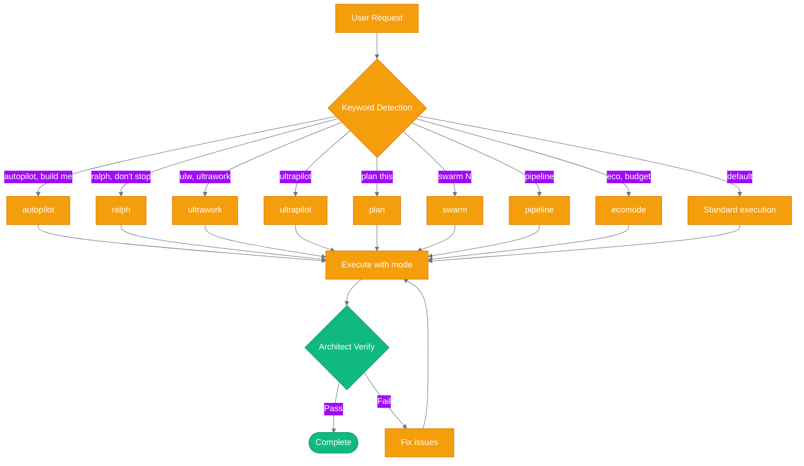
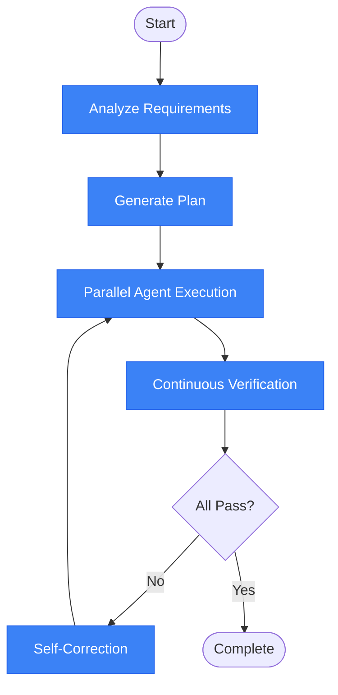
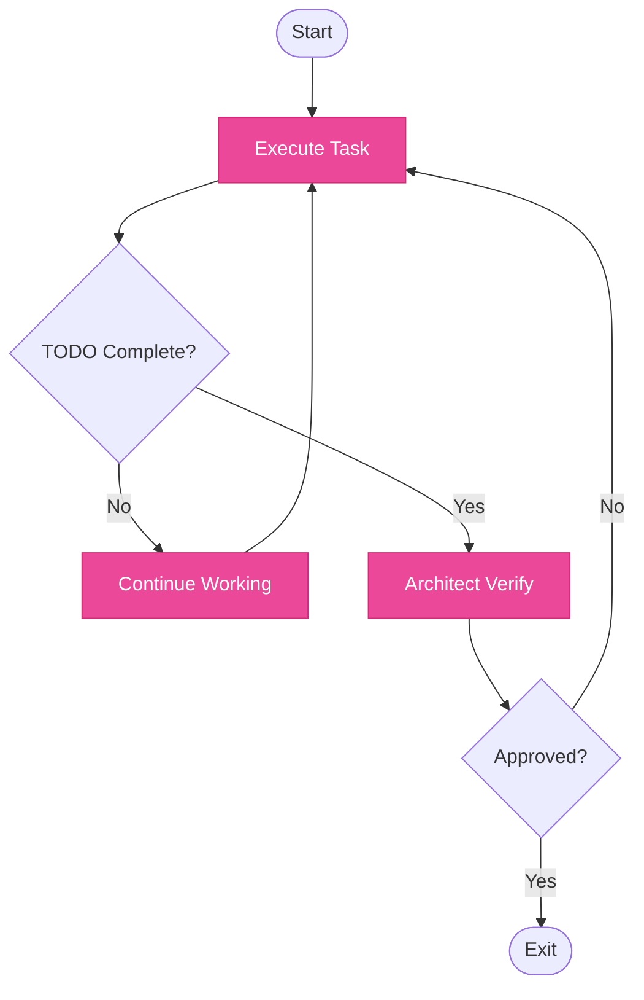
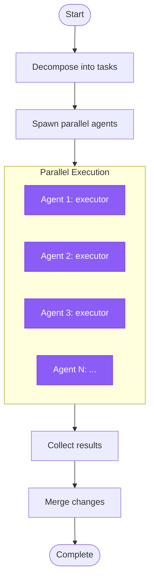
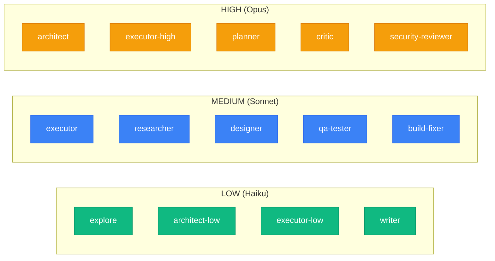

# omc (oh-my-claudecode) Workflow

<!-- workflow-viz: omc -->
<!-- last-updated: 2026-04-28 11:36:46 -->

## Overview

Multi-agent orchestration system with various execution modes.

## Mode Selection Flow

## autopilot Flow

## ralph Flow (Persistence Mode)

## ultrawork Flow (Parallel Execution)

## Agent Tiers

## State Files

| Mode | State Location |
|------|----------------|
| ralph | `.omc/state/ralph-state.json` |
| ultrapilot | `.omc/state/ultrapilot-state.json` |
| swarm | `.omc/state/swarm-tasks.db` (SQLite) |
| pipeline | `.omc/state/pipeline-{name}.json` |
