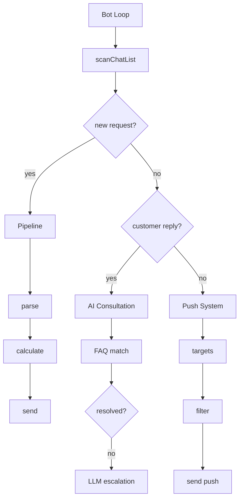

# Workflow diagram example (Step 9.5 Step A)

The 10-20 node workflow Step A presents to the user and stores in the state file.

Example workflow (ASCII, shown to user in terminal):
```
[Bot Loop] --> [scanChatList] --> <new request?>
                                    |yes --> [Pipeline]
                                    |         +--[parse]--[calculate]--[send]
                                    |no  --> <customer reply?>
                                               |yes --> [AI Consultation]
                                               |         +--[FAQ match]--<resolved?>
                                               |                           |no --> [LLM escalation]
                                               |no  --> [Push System]
                                                          +--[targets]--[filter]--[send push]
```

Stored as Mermaid in state file (`architecture.mermaidSource`):

