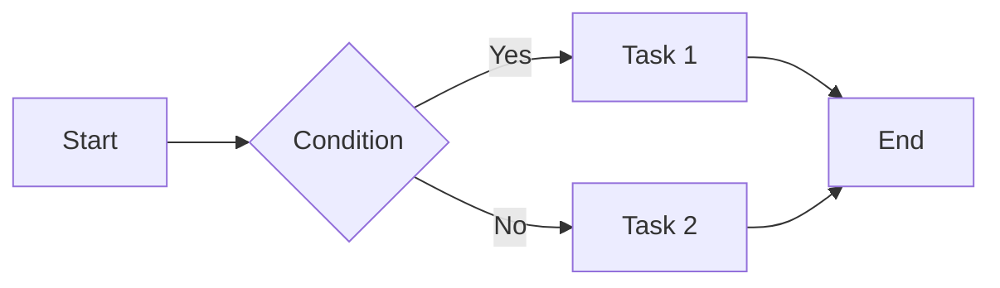
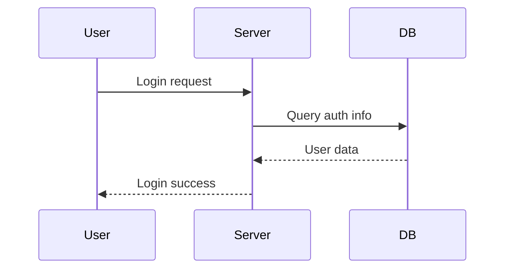
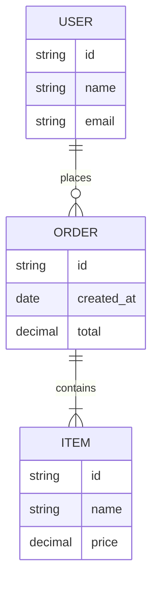
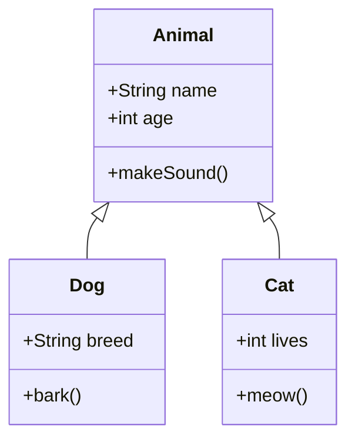
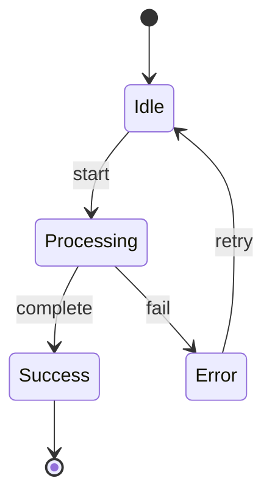
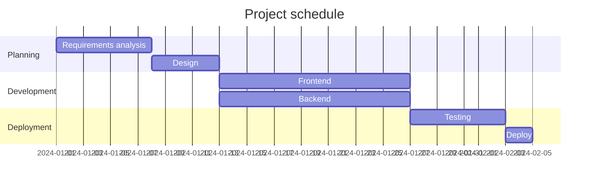
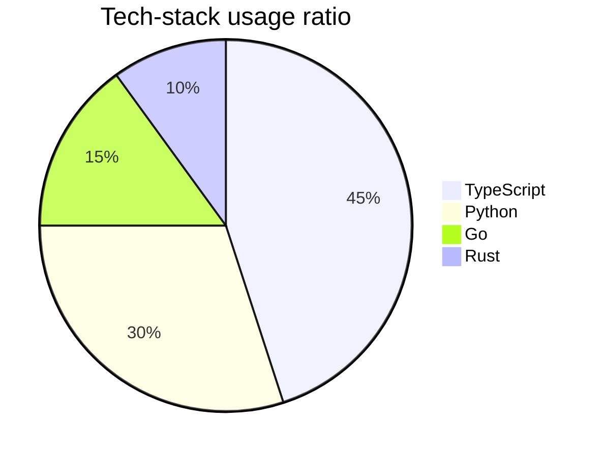
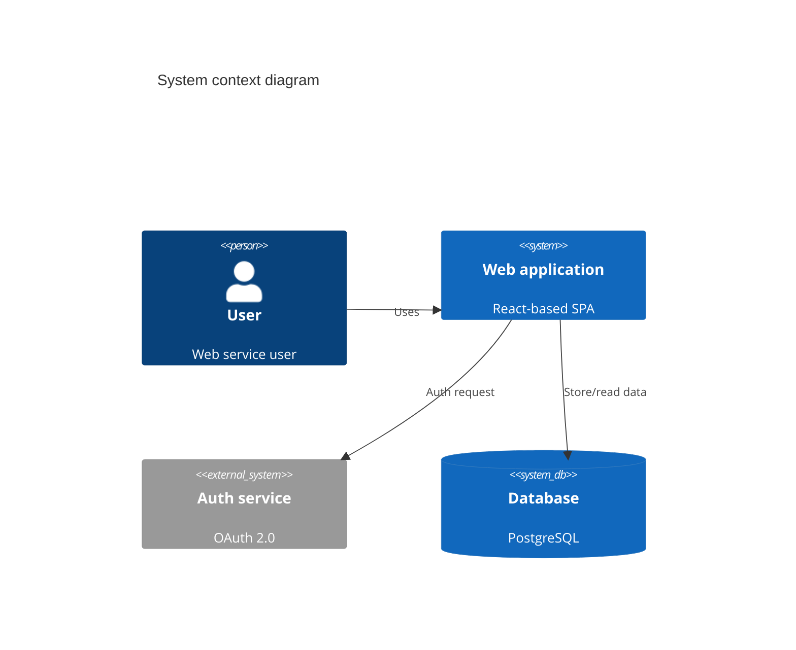
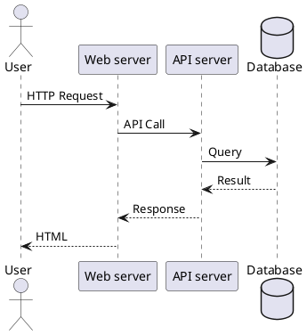
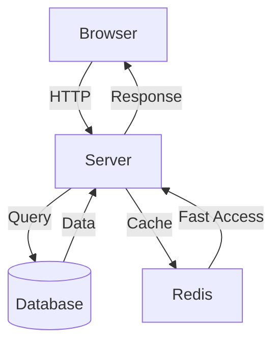

# Slidev syntax reference guide

A complete syntax reference for generating Slidev presentations.

## 1. Slide separators

Slides are separated by `---`.

```markdown
# First slide

Content

---

# Second slide

Content

---

# Third slide

Content
```

## 2. Frontmatter & Headmatter

### Headmatter (the first slide)

Write the whole-presentation configuration in the YAML frontmatter at the top of the first slide.

```yaml
---
theme: default
title: Presentation Title
info: |
  ## Presentation description
  Details can be written across multiple lines
author: Author Name
keywords: slidev, presentation, markdown
layout: cover
transition: slide-left
mdc: true
fonts:
  sans: Noto Sans KR
  serif: Noto Serif KR
  mono: Fira Code
---

# Title slide
```

**Key headmatter properties:**

| Property | Description | Example |
|------|------|------|
| `theme` | theme name | `default`, `seriph`, `apple-basic` |
| `title` | presentation title | `"My Presentation"` |
| `info` | description (multi-line allowed) | `"## Description\nDetails"` |
| `author` | author | `"John Doe"` |
| `keywords` | keywords (comma-separated) | `slidev, presentation` |
| `layout` | first-slide layout | `cover`, `intro`, `default` |
| `transition` | default transition | `slide-left`, `fade`, `zoom` |
| `mdc` | enable MDC syntax | `true`, `false` |
| `fonts` | font settings | see below |

### Per-slide Frontmatter

Each slide can have its own frontmatter.

```yaml
---
layout: two-cols
background: /images/background.jpg
class: text-center
transition: fade-out
clicks: 3
---

# Slide content

::right::

# Right-side content
```

**Key per-slide frontmatter properties:**

| Property | Description | Example |
|------|------|------|
| `layout` | slide layout | `default`, `two-cols`, `center`, `cover`, `section`, `quote`, `image-right` |
| `background` | background image/color | `/path/to/image.jpg`, `#1e1e1e`, `https://example.com/bg.png` |
| `class` | CSS class | `text-center`, `dark` |
| `transition` | transition | `slide-left`, `slide-up`, `fade`, `zoom` |
| `clicks` | number of click steps | `3` |
| `disabled` | disable the slide | `true` |
| `hide` | hide the slide | `true` |
| `routeAlias` | URL path alias | `/custom-path` |
| `src` | import an external file | `./slides/intro.md` |
| `zoom` | zoom ratio | `0.8`, `1.2` |

## 3. Presenter Notes

Write presenter notes as an HTML comment at the bottom of a slide.

```markdown
# Slide title

Slide content

<!--
Presenter notes:
- Point to emphasize 1
- Point to emphasize 2
- Expected time: 2 min
-->
```

They are shown only in presenter mode (`Presenter View`).

## 4. Code Blocks

### Basic syntax

````markdown
```typescript
function greet(name: string): string {
  return `Hello, ${name}!`;
}
```
````

### Line highlighting

````markdown
```typescript {2|4-6|all}
function calculate(a: number, b: number) {
  const sum = a + b;  // highlighted on the first click

  if (sum > 100) {    // lines 4-6 highlighted on the second click
    return sum * 2;
  }

  return sum;         // all highlighted on the third click
}
```
````

**Highlight syntax:**
- `{2}` - line 2
- `{2,5}` - lines 2 and 5
- `{2-5}` - lines 2 through 5
- `{2|4-6|all}` - highlight per click step
- `{2-5,8,10-12}` - a compound specification

### Line numbers

````markdown
```python {lines:true}
def fibonacci(n):
    if n <= 1:
        return n
    return fibonacci(n-1) + fibonacci(n-2)
```
````

### Max height

````markdown
```javascript {maxHeight:'200px'}
// scrolls when long code exceeds 200px
const data = [1, 2, 3, 4, 5, 6, 7, 8, 9, 10];
// ... many lines
```
````

### File name display

````markdown
```typescript {file:'src/utils.ts'}
export function formatDate(date: Date): string {
  return date.toISOString().split('T')[0];
}
```
````

### Combined usage

````markdown
```go {lines:true,maxHeight:'300px',file:'main.go'} {2,5-7|all}
package main

import "fmt"

func main() {
    fmt.Println("Hello, World!")
}
```
````

## 5. Shiki Magic Move

Expresses code changes as an animation.

````markdown
````md magic-move
```typescript
// Step 1: a basic function
function greet(name: string) {
  console.log("Hello " + name);
}
```

```typescript
// Step 2: add a return value
function greet(name: string): string {
  return "Hello " + name;
}
```

```typescript
// Step 3: use a template literal
function greet(name: string): string {
  return `Hello, ${name}!`;
}
```
````
````

**Features:**
- Automatically animates the changes between each code block
- Advances to the next step on each click
- Visually shows added/removed/modified lines

## 6. Monaco Editor

### Basic editor

````markdown
```typescript {monaco}
function fibonacci(n: number): number {
  if (n <= 1) return n;
  return fibonacci(n - 1) + fibonacci(n - 2);
}

console.log(fibonacci(10));
```
````

### Runnable editor

````markdown
```typescript {monaco-run}
console.log('You can see the run result in real time');
const result = [1, 2, 3].map(x => x * 2);
console.log(result);
```
````

### Diff mode

````markdown
```typescript {monaco-diff}
// Before
function oldFunction(x) {
  return x + 1;
}
~~~
// After
function newFunction(x: number): number {
  return x + 1;
}
```
````

**Monaco options:**
- `{monaco}` - an editable code editor
- `{monaco-run}` - runnable (JavaScript/TypeScript)
- `{monaco-diff}` - compare changes (separated by `~~~`)

## 7. LaTeX

### Inline math

```markdown
Pythagorean theorem: $a^2 + b^2 = c^2$

Area of a circle: $A = \pi r^2$
```

### Block math

```markdown
$$
\frac{-b \pm \sqrt{b^2 - 4ac}}{2a}
$$

$$
\begin{aligned}
  \nabla \times \vec{\mathbf{B}} -\, \frac1c\, \frac{\partial\vec{\mathbf{E}}}{\partial t} &= \frac{4\pi}{c}\vec{\mathbf{j}} \\
  \nabla \cdot \vec{\mathbf{E}} &= 4 \pi \rho \\
  \nabla \times \vec{\mathbf{E}}\, +\, \frac1c\, \frac{\partial\vec{\mathbf{B}}}{\partial t} &= \vec{\mathbf{0}} \\
  \nabla \cdot \vec{\mathbf{B}} &= 0
\end{aligned}
$$
```

**LaTeX examples:**

| Expression | Code |
|------|------|
| fraction | `\frac{a}{b}` |
| square root | `\sqrt{x}` |
| sigma | `\sum_{i=1}^{n} x_i` |
| integral | `\int_{a}^{b} f(x) dx` |
| limit | `\lim_{x \to \infty} f(x)` |
| matrix | `\begin{pmatrix} a & b \\ c & d \end{pmatrix}` |

## 8. Mermaid Diagrams

### Flowchart

````markdown

````

### Sequence Diagram

````markdown

````

### Entity Relationship Diagram

````markdown

````

### Class Diagram

````markdown

````

### State Diagram

````markdown

````

### Gantt Chart

````markdown

````

### Pie Chart

````markdown

````

### C4 Diagram

````markdown

````

## 9. PlantUML

````markdown

````

**Key PlantUML types:**
- `@startuml` / `@enduml` - start/end
- Supports Sequence, Use Case, Class, Activity, Component, State, Object diagrams

## 10. MDC Syntax

Using MDC (Markdown Components) requires `mdc: true` in the headmatter.

### Inline styles

```markdown
---
mdc: true
---

# MDC example

[Red text]{style="color:red"}

[Large text]{style="font-size:2em; font-weight:bold"}

[Background color]{style="background-color:yellow; padding:4px"}
```

### Block components

```markdown
::div{class="bg-blue-500 text-white p-4"}
A box with a blue background
::

::alert{type="warning"}
This is a warning message
::

::card{title="Title"}
Card content
::
```

### Passing props

```markdown
::component{prop1="value1" prop2="value2" class="custom-class"}
Component content
::
```

## 11. Scoped CSS

Add a `<style>` block to each slide to define styles that apply only to that slide.

```markdown
# A slide with styling

<div class="custom-box">
  A custom-styled box
</div>

<style>
.custom-box {
  background: linear-gradient(135deg, #667eea 0%, #764ba2 100%);
  color: white;
  padding: 2rem;
  border-radius: 12px;
  box-shadow: 0 4px 6px rgba(0,0,0,0.1);
}

h1 {
  color: #667eea;
  text-shadow: 2px 2px 4px rgba(0,0,0,0.1);
}
</style>
```

**Features:**
- Applies independent styling per slide
- Scoped styles, so no effect on other slides
- CSS, Sass, and Less all usable

## 12. Importing Slides

### src frontmatter

```yaml
---
src: ./slides/intro.md
---
```

### Example file structure

```
slides.md           (main file)
slides/
  ├── intro.md      (intro slides)
  ├── features.md   (feature slides)
  └── conclusion.md (conclusion slides)
```

**slides.md:**

```markdown
---
theme: default
title: My Presentation
---

# Cover slide

---
src: ./slides/intro.md
---

---
src: ./slides/features.md
---

---
src: ./slides/conclusion.md
---
```

**slides/intro.md:**

```markdown
# Intro

Content

---

# Background

Background description
```

## 13. Slot Sugar

Syntax for conveniently using a layout's slots.

### two-cols layout

```markdown
---
layout: two-cols
---

# Left content

Left column

::right::

# Right content

Right column
```

### image-right layout

```markdown
---
layout: image-right
image: /images/photo.jpg
---

# Text area

Text on the left

Image on the right
```

### Custom slots

```markdown
---
layout: custom-layout
---

# Default slot

::header::

# Header slot

::footer::

# Footer slot

::bottom::

# Bottom slot
```

**Key slots:**
- `::right::` - right area
- `::left::` - left area (explicit use)
- `::bottom::` - bottom area
- `::header::` - header area
- `::footer::` - footer area

## 14. Icons

Use various icon libraries via Iconify.

### Basic usage

```markdown
# Icon example

<mdi-account /> Account
<mdi-home /> Home
<carbon-email /> Email
<bi-github /> GitHub
<logos-vue /> Vue.js
```

### Applying styles

```markdown
<mdi-check class="text-green-500 text-2xl" />
<mdi-close style="color: red; font-size: 24px;" />
```

### Inline usage

```markdown
Vue <logos-vue class="inline" /> React <logos-react class="inline" />
```

**Key icon sets:**

| Prefix | Library | Example |
|--------|-----------|------|
| `mdi-` | Material Design Icons | `<mdi-check />` |
| `carbon-` | Carbon Icons | `<carbon-email />` |
| `bi-` | Bootstrap Icons | `<bi-github />` |
| `logos-` | Brand Logos | `<logos-vue />` |
| `heroicons-` | Heroicons | `<heroicons-home />` |
| `fa-` | Font Awesome | `<fa-user />` |

**Icon search:** [https://icones.js.org/](https://icones.js.org/)

## 15. Images

### public/ folder images

```markdown
# Local image


```

**File structure:**

```
public/
  └── images/
      ├── diagram.png
      └── photo.jpg
slides.md
```

### Remote images

```markdown


```

### Background image

```yaml
---
background: /images/background.jpg
---

# A slide with a background image
```

**Background options:**

```yaml
---
background: /images/bg.jpg
backgroundSize: cover
backgroundPosition: center
---
```

### Image layouts

```markdown
---
layout: image
image: /images/large.jpg
---
```

```markdown
---
layout: image-right
image: /images/side.jpg
---

# Text

Text on the left, image on the right
```

### Combining images and text

```markdown
<div class="grid grid-cols-2 gap-4">
  <div>
    
  </div>
  <div>
    
  </div>
</div>
```

---

## Practical example

### A complete slide example

````markdown
---
theme: default
title: Intro to TypeScript
info: |
  ## TypeScript basics
  The type system and modern JavaScript
author: John Doe
keywords: typescript, javascript, types
layout: cover
transition: slide-left
mdc: true
---

# Intro to TypeScript

A statically typed JavaScript superset

<div class="abs-br m-6">
  <logos-typescript-icon class="text-4xl" />
</div>

<!--
Opening greeting
Expected time: 1 min
-->

---
layout: two-cols
---

# Why TypeScript?

- <mdi-check class="text-green-500" /> Type safety
- <mdi-check class="text-green-500" /> Better developer productivity
- <mdi-check class="text-green-500" /> Editor support

::right::

# Problems with JavaScript

- <mdi-close class="text-red-500" /> Runtime errors
- <mdi-close class="text-red-500" /> Type uncertainty
- <mdi-close class="text-red-500" /> Hard to refactor

---
transition: fade-out
---

# Basic types

```typescript {1|3|5-7|all}
let name: string = "John";

let age: number = 30;

let isStudent: boolean = false;
let hobbies: string[] = ["reading", "coding"];
let point: [number, number] = [10, 20];
```

---

# Code evolution

````md magic-move
```javascript
// JavaScript
function add(a, b) {
  return a + b;
}
```

```typescript
// TypeScript - add types
function add(a: number, b: number) {
  return a + b;
}
```

```typescript
// TypeScript - explicit return type
function add(a: number, b: number): number {
  return a + b;
}
```
````

---
layout: center
---

# A math formula

Solution of a quadratic equation: $x = \frac{-b \pm \sqrt{b^2 - 4ac}}{2a}$

$$
\sum_{i=1}^{n} i = \frac{n(n+1)}{2}
$$

---

# Architecture



---
background: /images/code-bg.jpg
class: text-center
---

# Thank you

Questions?

<style>
h1 {
  color: white;
  text-shadow: 2px 2px 8px rgba(0,0,0,0.8);
}
</style>
````
````

---

## Notes

1. **File encoding:** UTF-8 required
2. **Image paths:** absolute paths relative to the `public/` folder (`/images/file.png`)
3. **Code blocks:** use 3 or 4 backticks
4. **YAML indentation:** 2 spaces recommended
5. **Mermaid:** consider rendering performance for complex diagrams
6. **LaTeX:** block form recommended for complex formulas
7. **MDC:** support varies by theme/layout

## Additional resources

- [Slidev official docs](https://sli.dev/)
- [Iconify icon search](https://icones.js.org/)
- [Mermaid docs](https://mermaid.js.org/)
- [KaTeX supported functions](https://katex.org/docs/supported.html)
- [Shiki language list](https://github.com/shikijs/shiki/blob/main/docs/languages.md)
